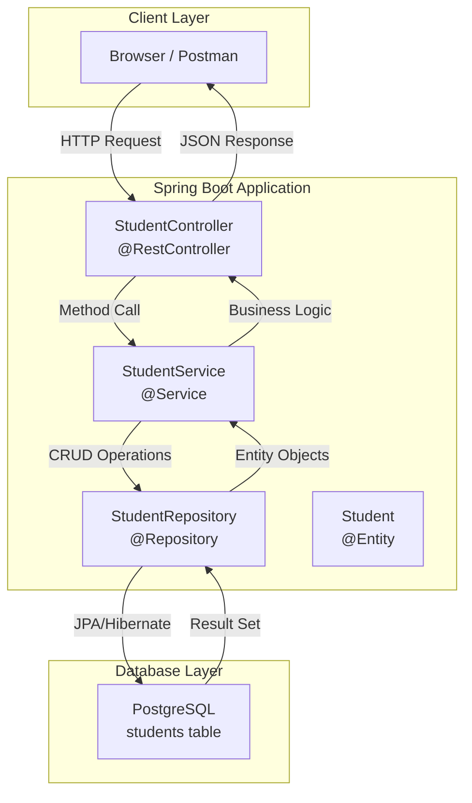
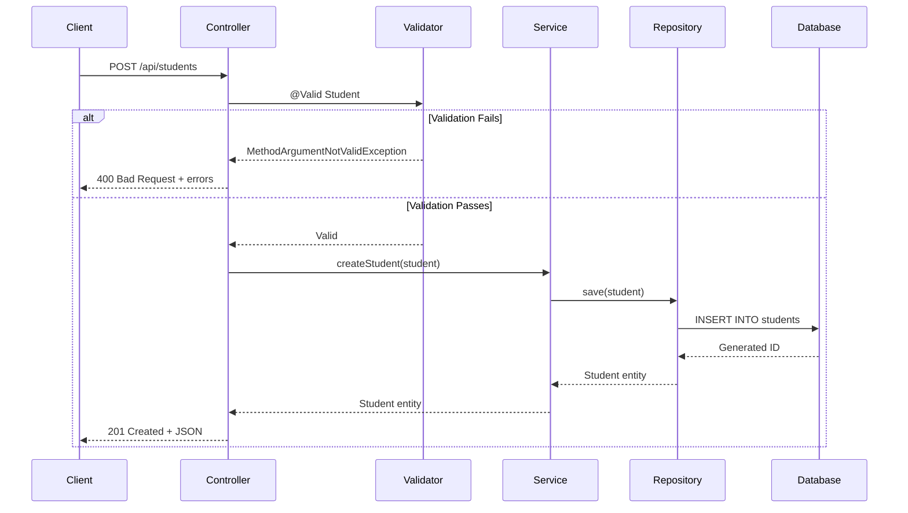
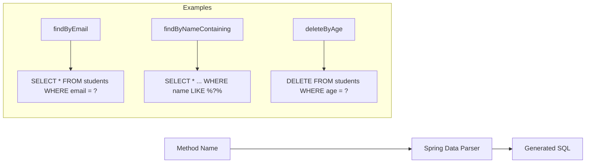
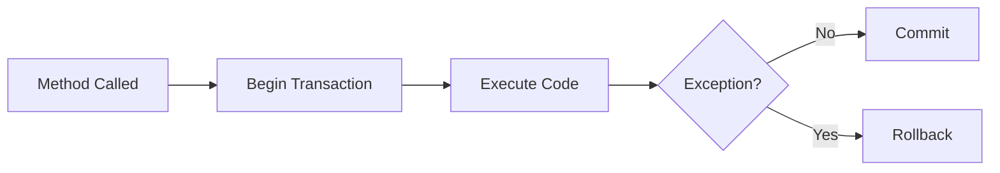
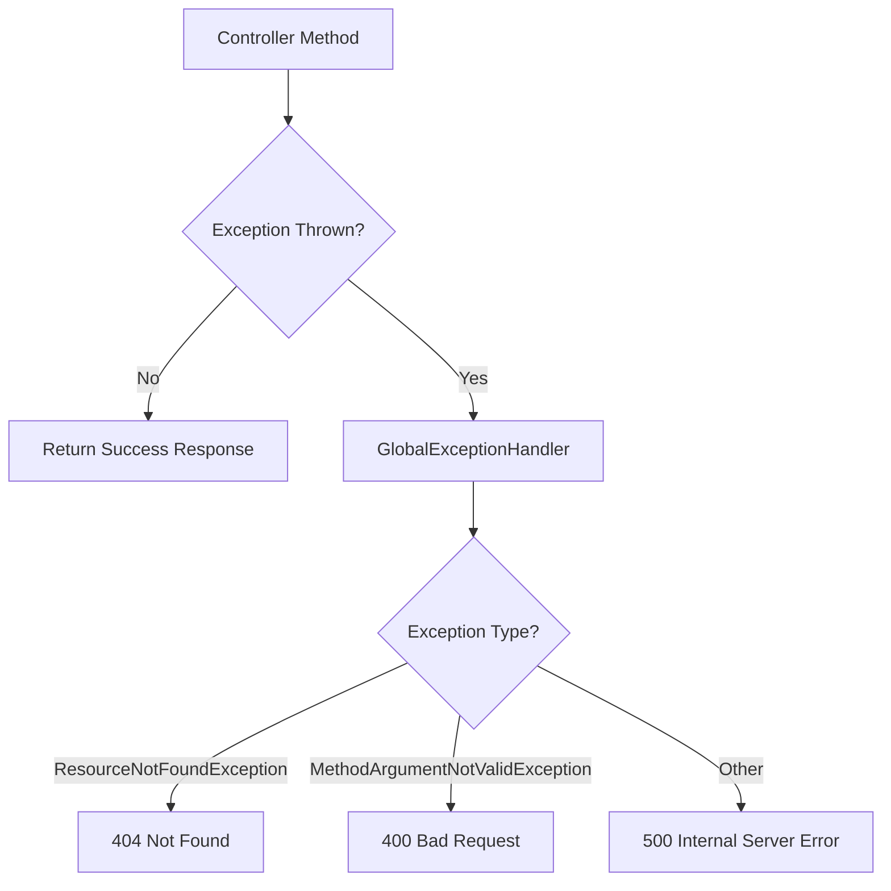
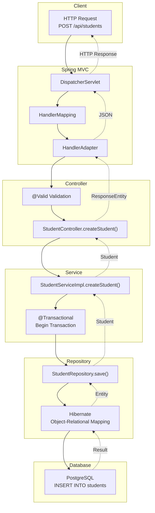

# Complete Project Documentation


A comprehensive documentation for understanding Spring Boot REST API development with JPA and PostgreSQL.


---


## Table of Contents


1. [Architecture Overview](#architecture-overview)

2. [Project Structure](#project-structure)

3. [Core Concepts](#core-concepts)

4. [Code Walkthrough](#code-walkthrough)

5. [API Flow](#api-flow)

6. [Interview Questions](#interview-questions)


---


## Architecture Overview





### Layered Architecture Pattern


| Layer           | Responsibility                                                | Annotations |

| **Controller**   | Handle HTTP requests, validation, response | `@RestController`, `@RequestMapping` |

| **Service**       | Business logic, transactions                            | `@Service`, `@Transactional` |

| **Repository** | Database operations                                      | `@Repository`, extends `JpaRepository`
| **Entity**          | Data model, table mapping                           | `@Entity`, `@Table` |


---


## Project Structure


```

src/main/java/com/student/management/

├── StudentManagementApplication.java   # Entry point

├── config/

│   └── CorsConfig.java                 # CORS settings

├── controller/

│   └── StudentController.java          # REST endpoints

├── dto/

│   └── ApiResponse.java                # Response wrapper

├── entity/

│   └── Student.java                    # JPA entity

├── exception/

│   ├── GlobalExceptionHandler.java     # Error handling

│   └── ResourceNotFoundException.java  # Custom exception

├── repository/

│   └── StudentRepository.java          # Data access

└── service/

    ├── StudentService.java             # Interface

    └── StudentServiceImpl.java         # Implementation

```


---


## Core Concepts


### 1. Spring Boot Annotations


```mermaid

mindmap

  root((Annotations))

    Core

      @SpringBootApplication

      @Configuration

      @Bean

    Web

      @RestController

      @RequestMapping

      @GetMapping

      @PostMapping

      @PutMapping

      @DeleteMapping

    Data

      @Entity

      @Table

      @Id

      @GeneratedValue

      @Column

    Validation

      @Valid

      @NotBlank

      @Email

      @Min

      @Max

    DI

      @Autowired

      @Service

      @Repository

```


### 2. Request Flow





---


## Code Walkthrough


### 1. Main Application Class


```java

@SpringBootApplication  // Combines @Configuration + @EnableAutoConfiguration + @ComponentScan

public class StudentManagementApplication {

    public static void main(String[] args) {

        SpringApplication.run(StudentManagementApplication.class, args);

        // Bootstraps Spring context, starts embedded Tomcat, configures beans

    }

}

```


**Key Points:**

- `@SpringBootApplication` is a meta-annotation

- `SpringApplication.run()` starts the entire application

- Auto-configuration detects dependencies and configures them


---


### 2. Entity Class (Student.java)


```java

@Entity                          // Marks as JPA entity (database table)

@Table(name = "students")        // Specifies table name

@Data                            // Lombok: generates getters, setters, toString, equals, hashCode

@NoArgsConstructor               // Lombok: no-args constructor (required by JPA)

@AllArgsConstructor              // Lombok: all-args constructor

@Builder                         // Lombok: builder pattern

public class Student {

  

    @Id                                              // Primary key

    @GeneratedValue(strategy = GenerationType.IDENTITY)  // Auto-increment

    private Long id;

  

    @NotBlank(message = "Name is required")          // Cannot be null or empty/whitespace

    @Size(min = 2, max = 100)                        // Length constraint

    @Column(nullable = false, length = 100)          // Database column constraint

    private String name;

  

    @NotBlank(message = "Email is required")

    @Email(message = "Please provide a valid email") // Email format validation

    @Column(nullable = false, unique = true)         // Unique constraint

    private String email;

  

    @NotNull(message = "Age is required")            // Cannot be null

    @Min(value = 1)                                  // Minimum value

    @Max(value = 150)                                // Maximum value

    @Column(nullable = false)

    private Integer age;

}

```


**Database Table Created:**

```sql

CREATE TABLE students (

    id BIGSERIAL PRIMARY KEY,

    name VARCHAR(100) NOT NULL,

    email VARCHAR(255) NOT NULL UNIQUE,

    age INTEGER NOT NULL CHECK (age >= 1 AND age <= 150)

);

```


---


### 3. Repository Interface


```java

@Repository  // Marks as Spring Data component, enables exception translation

public interface StudentRepository extends JpaRepository<Student, Long> {

    //                                              ^Entity   ^ID type

    // JpaRepository provides these methods automatically:

    // - save(entity)        → INSERT or UPDATE

    // - findById(id)        → SELECT by primary key

    // - findAll()           → SELECT all

    // - deleteById(id)      → DELETE by primary key

    // - count()             → COUNT(*)

    // Custom query methods (Spring Data derives SQL from method name)

    Optional<Student> findByEmail(String email);  // SELECT * WHERE email = ?

    boolean existsByEmail(String email);          // SELECT EXISTS(...)

}

```


**How Spring Data Works:**





---


### 4. Service Layer


```java

@Service                    // Marks as service bean

@RequiredArgsConstructor    // Lombok: constructor injection (final fields)

@Transactional              // All methods run in transaction

public class StudentServiceImpl implements StudentService {

  

    private final StudentRepository studentRepository;  // Injected by Spring

  

    @Override

    public Student createStudent(Student student) {

        return studentRepository.save(student);

        // save() checks if ID exists:

        //   - No ID/ID not in DB → INSERT

        //   - ID exists in DB → UPDATE

    }

  

    @Override

    @Transactional(readOnly = true)  // Optimized for read operations

    public List<Student> getAllStudents() {

        return studentRepository.findAll();

    }

  

    @Override

    @Transactional(readOnly = true)

    public Student getStudentById(Long id) {

        return studentRepository.findById(id)

                .orElseThrow(() -> new ResourceNotFoundException(

                    "Student not found with id: " + id

                ));

        // findById returns Optional<Student>

        // orElseThrow() extracts value or throws exception

    }

  

    @Override

    public Student updateStudent(Long id, Student studentDetails) {

        Student student = getStudentById(id);  // Throws if not found

        student.setName(studentDetails.getName());

        student.setEmail(studentDetails.getEmail());

        student.setAge(studentDetails.getAge());

        return studentRepository.save(student);  // UPDATE (because ID exists)

    }

  

    @Override

    public void deleteStudent(Long id) {

        Student student = getStudentById(id);  // Verify exists first

        studentRepository.delete(student);

    }

}

```


**Transaction Flow:**





---


### 5. Controller Layer


```java

@RestController                    // @Controller + @ResponseBody (returns JSON)

@RequestMapping("/api/students")   // Base URL path

@RequiredArgsConstructor           // Constructor injection

@CrossOrigin(origins = "http://localhost:3000")  // Allow frontend

public class StudentController {

  

    private final StudentService studentService;

  

    @PostMapping                   // POST /api/students

    public ResponseEntity<ApiResponse<Student>> createStudent(

            @Valid @RequestBody Student student) {

        //     ^validates       ^deserialize JSON to object

        Student created = studentService.createStudent(student);

        return new ResponseEntity<>(

            ApiResponse.success("Student created successfully", created),

            HttpStatus.CREATED  // 201

        );

    }

  

    @GetMapping                    // GET /api/students

    public ResponseEntity<ApiResponse<List<Student>>> getAllStudents() {

        List<Student> students = studentService.getAllStudents();

        return ResponseEntity.ok(

            ApiResponse.success("Students retrieved successfully", students)

        );

    }

  

    @GetMapping("/{id}")           // GET /api/students/1

    public ResponseEntity<ApiResponse<Student>> getStudentById(

            @PathVariable Long id) {

        //              ^extracts {id} from URL

        Student student = studentService.getStudentById(id);

        return ResponseEntity.ok(

            ApiResponse.success("Student retrieved successfully", student)

        );

    }

  

    @PutMapping("/{id}")           // PUT /api/students/1

    public ResponseEntity<ApiResponse<Student>> updateStudent(

            @PathVariable Long id,

            @Valid @RequestBody Student student) {

        Student updated = studentService.updateStudent(id, student);

        return ResponseEntity.ok(

            ApiResponse.success("Student updated successfully", updated)

        );

    }

  

    @DeleteMapping("/{id}")        // DELETE /api/students/1

    public ResponseEntity<ApiResponse<Void>> deleteStudent(

            @PathVariable Long id) {

        studentService.deleteStudent(id);

        return ResponseEntity.ok(

            ApiResponse.success("Student deleted successfully", null)

        );

    }

}

```


**HTTP Methods & CRUD:**


| HTTP Method | Endpoint | Action | SQL |

|-------------|----------|--------|-----|

| POST | `/api/students` | Create | INSERT |

| GET | `/api/students` | Read All | SELECT * |

| GET | `/api/students/{id}` | Read One | SELECT WHERE id=? |

| PUT | `/api/students/{id}` | Update | UPDATE WHERE id=? |

| DELETE | `/api/students/{id}` | Delete | DELETE WHERE id=? |


---


### 6. Exception Handling


```java

@RestControllerAdvice  // Global exception handler for all controllers

public class GlobalExceptionHandler {

  

    @ExceptionHandler(ResourceNotFoundException.class)

    public ResponseEntity<Map<String, Object>> handleNotFound(

            ResourceNotFoundException ex) {

        Map<String, Object> response = new HashMap<>();

        response.put("timestamp", LocalDateTime.now());

        response.put("status", 404);

        response.put("error", "Not Found");

        response.put("message", ex.getMessage());

        return new ResponseEntity<>(response, HttpStatus.NOT_FOUND);

    }

  

    @ExceptionHandler(MethodArgumentNotValidException.class)

    public ResponseEntity<Map<String, Object>> handleValidation(

            MethodArgumentNotValidException ex) {

        Map<String, String> errors = new HashMap<>();

        ex.getBindingResult().getAllErrors().forEach(error -> {

            String field = ((FieldError) error).getField();

            String message = error.getDefaultMessage();

            errors.put(field, message);

        });

        Map<String, Object> response = new HashMap<>();

        response.put("status", 400);

        response.put("error", "Validation Failed");

        response.put("errors", errors);

        return new ResponseEntity<>(response, HttpStatus.BAD_REQUEST);

    }

}

```


**Exception Flow:**





---


### 7. CORS Configuration


```java

@Configuration  // Marks as configuration class

public class CorsConfig {

  

    @Bean  // Creates a Spring-managed bean

    public CorsFilter corsFilter() {

        CorsConfiguration config = new CorsConfiguration();

        config.setAllowCredentials(true);  // Allow cookies

        config.setAllowedOrigins(Arrays.asList("http://localhost:3000"));

        config.setAllowedHeaders(Arrays.asList(

            "Origin", "Content-Type", "Accept", "Authorization"

        ));

        config.setAllowedMethods(Arrays.asList(

            "GET", "POST", "PUT", "DELETE", "OPTIONS"

        ));

        UrlBasedCorsConfigurationSource source =

            new UrlBasedCorsConfigurationSource();

        source.registerCorsConfiguration("/**", config);  // Apply to all paths

        return new CorsFilter(source);

    }

}

```


**Why CORS?**

- Browsers block requests from different origins for security

- Frontend at `localhost:3000` → Backend at `localhost:8080`

- CORS headers tell browser to allow cross-origin requests


---


### 8. Application Properties


```properties

# Server

server.port=8080

  

# Database Connection

spring.datasource.url=jdbc:postgresql://localhost:5432/student_db

spring.datasource.username=postgres

spring.datasource.password=Talha123

spring.datasource.driver-class-name=org.postgresql.Driver

  

# JPA/Hibernate

spring.jpa.hibernate.ddl-auto=update

#   - create: Drop and create tables

#   - create-drop: Create on start, drop on stop

#   - update: Update schema (add columns, don't remove)

#   - validate: Validate schema, no changes

#   - none: No action

  

spring.jpa.show-sql=true  # Log SQL queries

spring.jpa.properties.hibernate.format_sql=true  # Pretty print SQL

```


---


## API Flow


### Complete Request Lifecycle





---


## Interview Questions


### Basic Questions


1. **What is Spring Boot?**

> Framework that simplifies Spring application development with auto-configuration, embedded servers, and opinionated defaults.


2. **What is @RestController?**

> Combines `@Controller` and `@ResponseBody`. Methods return data directly as JSON instead of view names.


3. **Difference between @Controller and @RestController?**

> `@Controller` returns view names (for MVC). `@RestController` returns data directly (for APIs).


4. **What is JPA?**

> Java Persistence API - specification for ORM (Object-Relational Mapping). Hibernate is the implementation.


5. **What is Hibernate?**

> ORM framework that maps Java objects to database tables and handles SQL generation.


### Intermediate Questions


6. **Explain @Transactional**

> Ensures method runs in a database transaction. Auto commits on success, rolls back on exception.


7. **What is dependency injection?**

> Spring creates and injects object dependencies automatically. `@Autowired` or constructor injection.


8. **How does Spring Data JPA generate queries?**

> Derives SQL from method names: `findByEmail` → `SELECT * WHERE email = ?`


9. **What is ResponseEntity?**

> Wrapper for HTTP response with body, headers, and status code.


10. **Explain validation annotations**

> `@NotBlank` (not null/empty), `@Email` (valid format), `@Min/@Max` (range), `@Size` (length)


### Advanced Questions


11. **What happens when @Valid fails?**

> Throws `MethodArgumentNotValidException`, caught by `@ExceptionHandler` for custom error response.


12. **Explain CORS and why it's needed**

> Cross-Origin Resource Sharing. Browsers block cross-origin requests. CORS headers permit them.


13. **What is the N+1 query problem?**

> Loading parent entities, then making N queries for child entities. Solved with `JOIN FETCH`.


14. **Difference between save() and saveAndFlush()?**

> `save()` queues changes. `saveAndFlush()` immediately writes to database.


15. **What is @ControllerAdvice?**

> Global exception handler that applies to all controllers.


---


## Running the Application


```bash

# Start PostgreSQL and create database

CREATE DATABASE student_db;

  

# Run application

mvn spring-boot:run

  

# Access

# Frontend: http://localhost:8080

# API: http://localhost:8080/api/students

```


## Test Commands


```bash

# Create

curl -X POST http://localhost:8080/api/students \

  -H "Content-Type: application/json" \

  -d '{"name":"John Doe","email":"john@email.com","age":25}'

  

# Read All

curl http://localhost:8080/api/students

  

# Read One

curl http://localhost:8080/api/students/1

  

# Update

curl -X PUT http://localhost:8080/api/students/1 \

  -H "Content-Type: application/json" \

  -d '{"name":"John Updated","email":"john.new@email.com","age":26}'

  

# Delete

curl -X DELETE http://localhost:8080/api/students/1

```